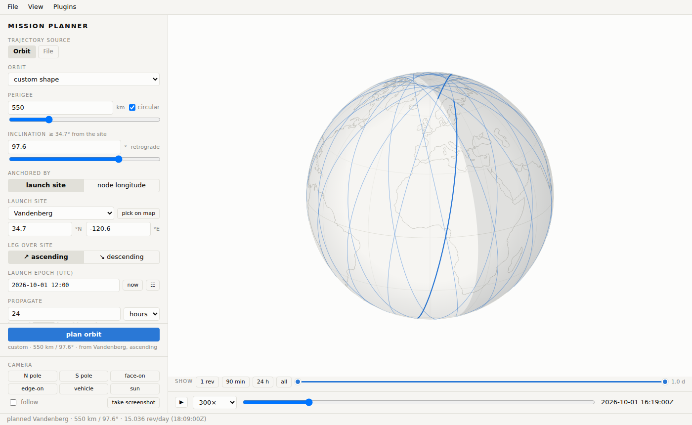
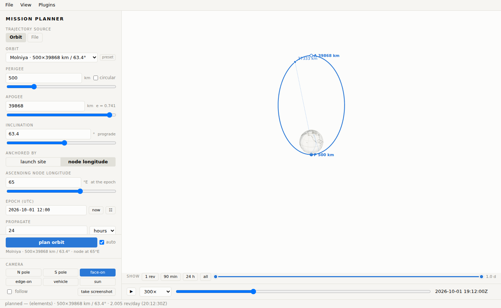
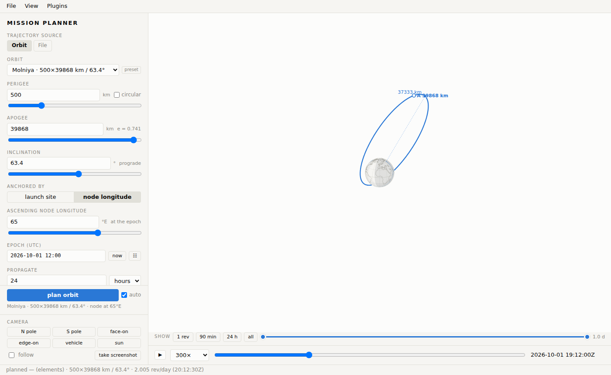

# The web UI

```bash
python -m mission_planner.server        # http://127.0.0.1:3030
```

A local, single-page app with no external assets. It has four parts: the
**menu bar** at the top (File, View, Plugins), the **side panel** on the left,
the **map** with its playback controls, and the **status bar** along the
bottom, where every message appears (errors in red; hover a long one to read
all of it).

## Where a plan comes from

The row of buttons at the top of the side panel picks the **trajectory
source**. Each source has its own options; the orbit form below follows once
the source is ready.

**Launch site**
:   An orbit whose plane passes over a site at the launch epoch. Choose a
    site from the catalog or *custom…* with your own latitude and longitude,
    and whether the site sits on the **ascending** (northeast-going) or
    **descending** leg. The inclination can't be below the site's latitude,
    and picking a site raises it if needed. For an elliptic orbit (an apogee
    above the perigee) **perigee position** places perigee that many degrees
    downrange of the site crossing.

**Orbit preset**
:   Textbook orbits anchored by elements rather than a site: ISS,
    Sun-synchronous, GPS / MEO, GTO, Molniya and GEO in the core catalog,
    plus any a data pack adds. The ascending node sits over the **node
    longitude** at the epoch (for GEO it is the station longitude). The
    sun-synchronous preset keeps the inclination at the exact SSO value for
    the altitude, sets the node from a **local time of ascending node**, and
    offers the repeat-ground-track family (12–16 revs per day).

**File**
:   A finished trajectory from a file: choose a stored file or upload one
    (drag and drop works). An active plugin that recognises the format
    describes it, offers its options, and turns it into a plan. The core
    reads no formats itself — they all come from plugins.

Plugins can add more sources; their buttons appear in the same row while the
plugin is on.

## Shape and propagation

For orbit sources the form below the source panel sets:

- **perigee altitude** (the slider covers low orbits; type higher values in
  the box) and **apogee** (blank = circular);
- **inclination**;
- **epoch** (UTC) and **hours** to propagate;
- **propagation mode**: *kepler + J2* (no drag) or *drag decay*, which asks
  for a **ballistic coefficient** β = m / (C<sub>d</sub>A) in kg/m². Plugins
  can add modes; slow ones run in the background with progress in the status
  bar.

**plan orbit** computes it. The summary below the panels shows the launch
site and azimuth (for a site), the period, revs per day and RAAN drift, and
the orbital elements at the epoch.

## The map



The **View** menu switches the projection:

| view | what it shows | mouse |
|---|---|---|
| **Map** | a flat map that scrolls sideways without end | drag to pan, wheel zooms about the cursor |
| **Globe** | the map on a sphere | drag to rotate, wheel zooms |
| **Orbit** | the orbit in space around the Earth, scaled to fit — best for high orbits; in the **ECI** (inertial) or **ECEF** (Earth-fixed) frame, optionally with the ground trace | drag to rotate, wheel zooms |

Double-click resets the zoom in every view.

### Camera views

The **camera** buttons at the bottom of the side panel aim the globe and
orbit views along a direction that means something. From the flat map they
switch to the orbit view.

| view | looks |
|---|---|
| **N pole** / **S pole** | down on a pole |
| **face-on** | square to the orbit plane of the track in focus — the orbit's true shape, the Earth at a focus |
| **edge-on** | in the orbit plane, along the line of nodes — the plane as a line tilted by the inclination |
| **vehicle** | straight down on the vehicle (on the flat map: centres the map on it) |
| **sun** | from the sun — the day side |

With **follow** ticked, the view stays aimed as playback runs: the orbit
plane turns under the Earth's axes, and the vehicle view becomes a chase
camera. Dragging the map lets go of the view.





The **layers** section of the View menu toggles:

- **horizon footprint at playback time** — the ground that can see the
  vehicle (0° elevation);
- **night shading** — day and night at the playback time;
- **map overlays** from data packs, one by one or all at once with
  **Hide all overlays**.

Every marker is clickable. Clicking the vehicle, a perigee / apogee marker
(**P** / **A** on elliptic orbits), the entry point or a scene marker opens a
small readout with latitude, longitude, altitude and the Earth-relative
flight-path angle γ.

## Playback and the display window

The bar under the map plays the plan back: ▶ / ❚❚, a speed (60× to 14400×),
the time slider and the UTC clock.

The **show** row above it chooses how much of the track is drawn: **1 rev**,
**90 min**, **24 h** or **all**, or drag the two handles of the window slider
for any span. The vehicle marker and footprint follow the playback time.

## Plans with several tracks

A source can return several tracks at once — a satellite constellation, or a
vehicle whose trajectory branches. The **in focus** picker below the plan
button lists them. The panels, markers and modules work on the track in
focus; the others are drawn faintly. Click a vehicle on the map to focus it.
A track may carry a colour of its own (a branch drawn in red, say); it stays
plainly visible whether it's in focus or not.

## Built-in panels

The panels under the form are modules. They draw on the map only while open.

**Target passes**
:   Click the map (or type a latitude, longitude) to set a target and a miss
    distance; the table lists every overflight window with UTC times, the
    closest approach, heading and leg. Click a row to jump playback there.
    A *pass* here is the ground track coming within that distance of the
    target — not line of sight; the horizon footprint answers that.

**Maneuver planner**
:   Impulsive budgets between two circular orbits: Hohmann legs, the plane
    change separate or combined into the far burn, optional co-orbital
    phasing for a target that leads by some angle, and deorbit to the 100 km
    interface.

**Drag decay**
:   After a plan in a drag mode: an altitude-vs-time sparkline (for an
    elliptic orbit, the mean altitude inside a band from perigee to apogee
    that closes as drag circularizes the orbit), and the entry
    interface crossing (and impact, for modes that fly to the ground).

### The ground-station plugin

The ground station is a plugin that ships with mission-planner in
`examples/groundstation/` and is installed with it; it is
also the worked example of the [plugin tutorial](../tutorial.md).

**Ground station**
:   Place a station (**place on map**, then click; Esc cancels) or type its
    coordinates, and set an **elevation mask** (10° by default). The panel
    says which vehicles are above the mask now, sums up the coverage (number
    of contacts, time in contact, longest gap) and lists the contact windows
    — AOS, duration, maximum elevation, azimuth from AOS to LOS; click one to
    jump there. The map shows the station and a dashed ring: while the
    vehicle's subpoint is inside it, the vehicle is above the mask. A
    View-menu toggle limits the horizon footprints to the vehicles above the
    mask. The station is remembered in this browser; agents get the same
    answers from the `ground_contacts` MCP tool.

## Menus

**File**
:   **Export track (CSV)** — the track in focus as `utc, t_s, lat_deg,
    lon_deg, alt_km`. **Export plan (JSON)** — the whole plan as the server
    returned it. Plugins may add items.

**View**
:   Projection, orbit-view frame, layers and overlays, as above.

**Plugins**
:   Every installed plugin with what it adds, its status — active, off,
    waiting on a plugin it requires, unavailable (a missing dependency) or
    failed (with the reason) — and an on/off switch that takes effect at once,
    without a reload. The switches live on the server, so every open tab sees
    them. `MP_DISABLE_MODULES=a,b` sets which plugins start switched off.

## Plans pushed by an agent

An agent can put a plan into the open tab (the MCP tool `show_plan`, or a
scene with a `plan` posted to `/api/scene`). It replaces what's on the map as
if you had planned it yourself, with any annotations the agent added (a target
marker, a table of passes) in a legend at the top right. Plan something else
and the annotations go with it. See [Agents — MCP and REST](agents.md).
