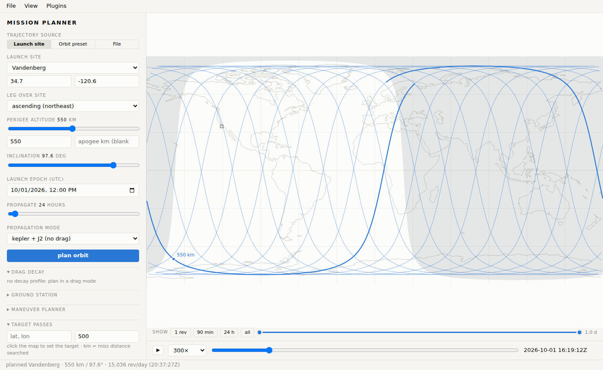

# mission-planner

**Generic orbital mission planning.** Design an orbit over a launch site at a
real UTC epoch, propagate it (two-body + J2, or drag decay from a ballistic
coefficient), find when it passes over a target, work out manoeuvre budgets —
and see all of it on a local map that both people and AI agents can drive.



## What it does

<div class="grid cards" markdown>

- **Plan an orbit** — from a launch site (it picks the RAAN so the plane
  passes over the site at the epoch), from textbook presets (ISS, SSO, GPS,
  GTO, Molniya, GEO), or from a file a plugin can read.
- **Propagate it** — Kepler + J2 secular in milliseconds, or an averaged
  King-Hele drag decay down to the 100 km entry interface. Plugins add
  higher-fidelity propagators as extra modes.
- **Ask questions of it** — overflight windows of a target, the horizon
  footprint, Hohmann / plane-change / phasing / deorbit Δv, the
  ground station's view.
- **See it** — a flat map that scrolls endlessly, a globe, and a 3-D orbit
  view in the inertial or Earth-fixed frame, with playback and a display
  window.
- **Drive it from an agent** — an MCP server (`plan_orbit`, `find_passes`,
  `show_plan`, …) and a JSON REST API; an agent can push a plan or a scene
  into the open browser tab.
- **Extend it** — everything beyond the core is a plugin: REST routes, UI
  panels, map layers, MCP tools, propagation modes, trajectory sources, file
  formats and catalog data, all switchable live.

</div>

## Where to start

| you want to… | read |
|---|---|
| install it and plan your first orbit | [Getting started](getting-started.md) |
| use the map UI | [The web UI](guide/web-ui.md) |
| script it in Python | [Python library](guide/library.md) |
| connect an AI agent | [Agents — MCP and REST](guide/agents.md) |
| add launch sites, presets or map overlays | [Catalog data](guide/catalog.md) |
| know what the physics does and doesn't model | [Models and assumptions](guide/models.md) |
| add a capability of your own | [Plugin guide](plugins.md) |

## At a glance

```python
from mission_planner import Orbit, SITES

orb = Orbit.from_launch_site(SITES["Vandenberg"], alt_km=550, inc_deg=97.6)
orb.summary()["revs_per_day"]            # 15.04
gt = orb.ground_track(24 * 3600)         # kepler + J2, 30 s steps
gt.passes(34.7, -120.6, within_km=500)   # overflight windows of a target, UTC
```

```bash
python -m mission_planner.server         # the map UI on http://127.0.0.1:3030
python -m mission_planner.mcp_server     # the MCP server, for agents
```

mission-planner is open source under the
[Apache-2.0 licence](https://github.com/hahnpv/mission-planner/blob/main/LICENSE).
