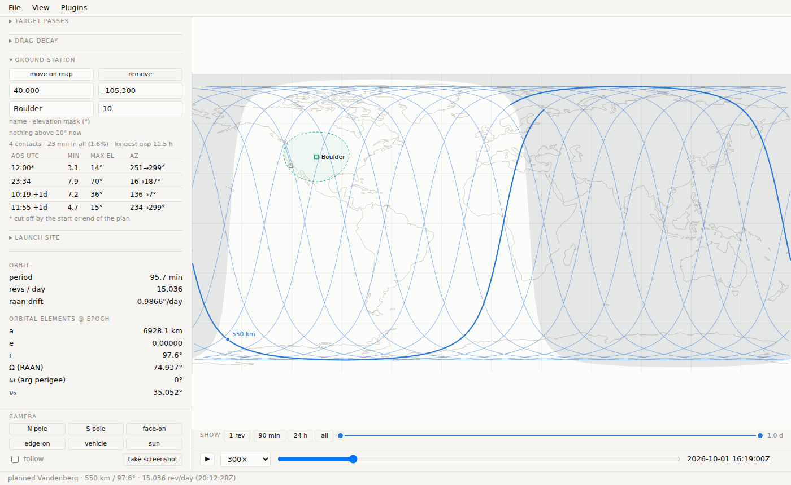

# Tutorial: a ground-station plugin

This tutorial builds a complete mission-planner plugin, one capability at a
time. Each step ends with something you can see work. The result is the
**ground station** plugin that ships with mission-planner: a station on the
map with an elevation mask, its contact windows and coverage in a side panel,
the same answers over REST and as an MCP tool for agents.



The finished code is in the repository under
[`examples/groundstation/`](https://github.com/hahnpv/mission-planner/tree/main/examples/groundstation).
Every excerpt below comes from it; read the files alongside if you like.
The [Plugin guide](plugins.md) is the reference for every key and hook used
here.

```text
examples/groundstation/
├── pyproject.toml               # 1: the entry point
├── README.md
├── mp_groundstation/
│   ├── __init__.py              # 1, 3, 4: spec, route, MCP tool
│   ├── contacts.py              # 2: the math
│   └── static/groundstation.js  # 5-7: panel, map layers
└── tests/
    ├── conftest.py              # makes the package importable uninstalled
    └── test_groundstation.py    # 8: tests
```

## 1. A plugin that does nothing

A plugin is an installed Python package that hands mission-planner a
**spec** — a dict — through an entry point in the `mission_planner.plugins`
group.

```toml title="pyproject.toml"
[project]
name = "mission-planner-groundstation"
version = "0.1.0"
dependencies = ["mission-planner", "numpy>=1.24"]

# The line that makes this a mission-planner plugin: an entry point in the
# `mission_planner.plugins` group, named like the spec's `name`.
[project.entry-points."mission_planner.plugins"]
groundstation = "mp_groundstation:MODULE"
```

```python title="mp_groundstation/__init__.py"
MODULE = {
    "api": 1,
    "name": "groundstation",
    "title": "ground station",
    "description": "a ground station on the map: elevation mask, contact windows, coverage",
}
```

Install it next to mission-planner and start the UI. For a plugin of your
own that is `pip install -e path/to/your-plugin`; this one needs no step of
its own, because mission-planner's install ships it (the core's
`pyproject.toml` carries the same entry point):

```bash
pip install -e .                 # from the mission-planner checkout
python -m mission_planner.server
```

Open the **Plugins** menu: *ground station* is listed, active, with an on/off
switch. That is the whole contract — everything else is optional keys on
that dict.

!!! tip "Two rules from the start"
    **Importing the spec must never fail**: the core catches the error and
    shows the plugin as *failed*, but none of it works. Keep optional imports
    inside functions or guarded. And **import only the core's public
    surface** — `planning`, `orbit`, `groundtrack`, `timebase`, `constants`
    and the other modules the [Plugin guide](plugins.md#1-the-minimum)
    lists — never `server`, `mcp_server` or a `_`-prefixed name.

## 2. The math, as a plain function

Put the computation in plain functions that know nothing about the UI: they
are the easiest thing to test, and the route, the panel and the MCP tool
become thin skins over them.

The question is *when is the vehicle at least `min_el` degrees above the
station's horizon?* On mission-planner's spherical Earth, with ψ the central
angle between the station and the vehicle's subpoint and r the vehicle's
distance from the Earth's centre:

$$
\text{elevation} = \operatorname{atan2}\!\left(\cos\psi - \frac{R_E}{r},\ \sin\psi\right)
$$

A `GroundTrack` exposes its samples as arrays — `t` (s past `epoch`),
`lat`, `lon` (radians), `alt` (metres) — so the whole track is one numpy
expression:

```python title="mp_groundstation/contacts.py"
def look_angles(gt, lat_deg: float, lon_deg: float) -> tuple[np.ndarray, np.ndarray]:
    """(elevation, azimuth) [deg] of the vehicle from the station, per sample."""
    lat, lon = math.radians(lat_deg), math.radians(lon_deg)
    c = np.sin(lat) * np.sin(gt.lat) + np.cos(lat) * np.cos(gt.lat) * np.cos(gt.lon - lon)
    psi = np.arccos(np.clip(c, -1.0, 1.0))
    r = RE + np.maximum(np.asarray(gt.alt, dtype=float), 0.0)
    el = np.degrees(np.arctan2(np.cos(psi) - RE / r, np.sin(psi)))
    az = np.degrees(bearing(lat, lon, gt.lat, gt.lon)) % 360.0
    return el, az
```

`contacts(gt, lat_deg, lon_deg, min_el_deg=10.0)` then finds each run of
samples above the mask, interpolates acquisition (AOS) and loss (LOS) between
samples, and reports duration, maximum elevation and azimuths.
`coverage(windows, span_s)` sums a list of windows up: how many, the mean
length of one, the time in contact with at least one track (overlapping
windows of several tracks are merged), the longest gap. Try them straight
from Python:

```python
from mission_planner import Orbit, SITES
from mp_groundstation.contacts import contacts

orb = Orbit.from_launch_site(SITES["Vandenberg"], alt_km=550, inc_deg=97.6)
for w in contacts(orb.ground_track(24 * 3600), 40.0, -105.0, min_el_deg=10):
    print(w["aos_utc"], w["duration_s"], w["max_el_deg"])
```

Bad input is a `ValueError` with a message a person can act on — the core
turns that into an HTTP 400 or a tool error for you:

```python
if not -90.0 < min_el_deg < 90.0:
    raise ValueError("min_el_deg must be between -90 and 90 degrees")
```

## 3. A REST route

A flask **blueprint** in the spec's `blueprint` key is mounted by the core
and gated on the plugin's switch: switch the plugin off and its routes
answer 404.

The route must plan the same trajectory the user is looking at. It doesn't
parse the plan's parameters itself: `planning.track_from_args` reads the same
query arguments as `/api/plan`, for **any** trajectory source — a planned
orbit, a file, a constellation — and returns one track or a list of them.

```python title="mp_groundstation/__init__.py"
from mission_planner.planning import opt_float, track_from_args

def station_contacts(args, lat_deg: float, lon_deg: float, min_el_deg: float) -> dict:
    """Contact windows of every track of the plan `args` describes (query
    args, as /api/plan takes them), in time order, with the coverage summary."""
    _, meta, gt = track_from_args(args)
    tracks = gt if isinstance(gt, (list, tuple)) else [gt]
    ...  # contacts() per track, in time order, plus coverage()

try:
    from flask import Blueprint, jsonify, request

    bp = Blueprint("groundstation", __name__, url_prefix="/api/groundstation")

    @bp.route("/contacts")
    def _contacts_route():
        a = request.args
        lat, lon = opt_float(a, "gs_lat"), opt_float(a, "gs_lon")
        if lat is None or lon is None:
            raise ValueError("gs_lat and gs_lon are required")  # the core answers 400
        return jsonify(station_contacts(a, lat, lon, opt_float(a, "min_el", 10.0)))
except ImportError:  # library use without flask
    bp = None

MODULE = {
    ...,
    "blueprint": bp,
}
```

The flask import is guarded, so the plugin still imports where only the
library is installed. Restart the server and ask it:

```bash
curl 'http://127.0.0.1:3030/api/groundstation/contacts?site=Vandenberg&hp=550&inc=97.6&hours=24&gs_lat=40&gs_lon=-105&min_el=10'
```

## 4. An MCP tool

Any function in `mcp_tools` becomes a tool of the MCP server. Its name,
annotated parameters and docstring are what the agent sees, so write the
docstring for a reader who has only that. Take the core tools' orbit
keywords (`plan_orbit`, `find_passes`) and let `args_from_params` turn them
into the query arguments the route already understands. Unlike the panel,
which follows whatever plan is on screen, the tool plans a Kepler orbit of
its own (it takes no `mode` or `beta`):

```python title="mp_groundstation/__init__.py"
from mission_planner.planning import DEFAULT_SITE, args_from_params, default_dt

def ground_contacts(
    gs_lat: float,
    gs_lon: float,
    min_el_deg: float = 10.0,
    site: str = DEFAULT_SITE,
    alt_km: float = 400.0,
    inc_deg: float = 51.6,
    epoch_utc: str | None = None,
    hours: float = 24.0,
    ...
) -> dict:
    """Contact windows between a ground station and a planned orbit: every
    interval in which the vehicle is at least `min_el_deg` above the
    station's horizon ... The orbit parameters are plan_orbit's ..."""
    args = args_from_params(
        site=site, alt_km=alt_km, inc_deg=inc_deg, epoch_utc=epoch_utc, ...
    )
    args.update(hours=hours, dt=default_dt(hours, 10.0))
    return station_contacts(args, gs_lat, gs_lon, min_el_deg)

MODULE = {
    ...,
    "mcp_tools": [ground_contacts],
}
```

Restart the MCP server and an agent can ask *"when does a 550 km SSO from
Vandenberg see Boulder above 10°?"*. Tool names must be unique across the
core and every plugin; a clash marks the later plugin *failed*.

## 5. A side panel

The UI half is a script named by `js`, served from `static_dir`:

```python
from pathlib import Path

MODULE = {
    ...,
    "js": "groundstation.js",
    "static_dir": Path(__file__).parent / "static",
}
```

The script registers a panel with `MP.register`. Everything it needs from
the core comes through the `ctx` passed to `init` — that is what makes the
panel go quiet when the plugin is switched off:

```js title="mp_groundstation/static/groundstation.js"
MP.register({
  title: "ground station",
  html: `
    <div class="row">
      <button id="gs_place" class="small" type="button">place on map</button>
      <button id="gs_clear" class="small ghost" type="button">remove</button>
    </div>
    ...
      <input id="gs_mask" type="number" step="1" min="0" max="89" value="10"
             title="elevation mask: the lowest elevation that counts as contact">
    ...
    <div id="gs_cov" class="hint" style="margin-top:4px"></div>
    <div id="gs_table"></div>`,
  init(ctx) {
    const $g = id => document.getElementById("gs_" + id);
    ...
  },
});
```

Give element ids a short prefix (`gs_`) so panels never collide, and put any
CSS in a `<style>` block inside `html`.

The panel asks the route of step 3 for the plan on screen. `ctx.planArgs()`
is the query of the request that produced the current plan, so the server
recomputes exactly that trajectory:

```js
    async function refresh() {
      if (!gs || !ctx.getPlan() || !ctx.isOpen()) return;
      const my = ++reqSeq;
      const q = ctx.planArgs();
      q.set("gs_lat", gs.lat); q.set("gs_lon", gs.lon); q.set("min_el", mask());
      $g("cov").textContent = "finding contacts…";
      let r;
      try { r = await ctx.api("/api/groundstation/contacts?" + q); }
      catch (e) { r = { error: "server unreachable: " + e.message }; }
      if (my !== reqSeq) return;   // the station, mask or plan changed meanwhile
      if (r.error) { $g("cov").textContent = ""; ctx.status("ground station: " + r.error, true); return; }
      ...   // fill #gs_cov and #gs_table from r.coverage and r.contacts
      $g("table").querySelectorAll("tbody tr").forEach(tr => tr.onclick = () => ctx.seek(+tr.dataset.t));
    }
    ctx.onPlan(() => refresh());
    ctx.onToggle(open => { if (open) refresh(); });
```

- `ctx.onPlan` fires after every new plan (and when the focus moves to
  another track); `ctx.onToggle` when the panel is opened or closed. Work
  only while `ctx.isOpen()`: a closed panel costs nothing.
- `ctx.api` returns the JSON body, with an `error` field on a 4xx/5xx, and
  throws when the server can't be reached — hence the `try/catch`, which
  turns that into the same `error` path.
- `ctx.status` writes to the status bar at the bottom of the window.
- `ctx.seek(t_s)` moves playback — clicking a contact jumps to its maximum
  elevation.

## 6. Clicks and map layers

Placing the station is a map click. `ctx.onClick` hands you the latitude and
longitude of any click on the map or globe; the plugin only acts on one after
**place on map** was pressed, so it never steals clicks from other panels:

```js
    ctx.onClick((lat, lon) => {
      if (!placing) return;
      placing = false;
      setStation(lat, lon);
      ctx.status(`ground station at ${gs.lat.toFixed(3)}°, ${gs.lon.toFixed(3)}°.`);
    });
```

Drawing goes through `ctx.onDraw` (under the ground track) and
`ctx.onDrawOver` (over it). They run on every redraw — every frame of a drag
or of playback — so keep them cheap. Draw with the draw context `d`, never
with your own SVG: `d.polygon`, `d.polyline` and `d.marker` work unchanged on
the flat map, the globe and the orbit view.

The ring inside which the vehicle in focus is above the mask, at its altitude
right now:

```js
    ctx.onDraw(d => {
      if (!gs || !d.plan || !ctx.isOpen()) return;
      const tr = d.plan.track, k = d.idxAtTime(d.tCur, tr);
      const [lats, lons] = circle(ringDeg(tr.alt_km[k]));
      d.polygon(lats, lons, { fill: d.C.green, "fill-opacity": 0.06, stroke: d.C.green,
                              "stroke-width": 1, "stroke-dasharray": "4 3" });
    });
```

And the station itself, as a clickable marker with a readout:

```js
    ctx.onDrawOver(d => {
      if (!gs) return;
      ...   // `seen`: who is above the mask now, for the panel line and the readout
      d.marker(gs.lat, gs.lon, d.C.green, "site", gs.name,
        { key: "gs", title: gs.name,
          rows: [["mask", `${mask()}°`], ["in contact", String(seen.length)]].concat(
            seen.slice(0, 6).map(([n, e]) => [n, `el ${e.toFixed(1)}°`])) });
    });
```

A marker's `key` must be the same on every redraw (`"gs"`, not a counter):
the map is rebuilt from scratch each frame, and the key is how an open
readout survives that.

## 7. The View menu and the footprint filter

Plugins can add rows to the menus. A display toggle in **View → layers**
here limits the horizon footprints to the vehicles above the station's mask,
through the core's footprint filter hook:

```js
    ctx.addDisplayToggle("footprints: only vehicles above the ground station's mask", false, v => {
      onlyVisible = v;
      if (v && !gs) ctx.status("place a ground station first (ground station panel).", true);
      ctx.redraw();
    });
    ctx.footprintFilter((tr, k) => (onlyVisible && gs ? elevation(tr, k) >= mask() : null));
```

A filter answers `true` / `false` per vehicle, or `null` to stay out of it.
With a constellation on screen, this shows at a glance which satellites the
station can talk to right now.

Finally, contacts make sense for any kind of plan, not only planned orbits,
so the spec says so — otherwise the panel would go inert on a trajectory
from a file:

```python
MODULE = {
    ...,
    "works_with": ["orbit", "trajectory"],
}
```

## 8. Tests

A plugin doesn't need to be installed to be tested: put its spec straight
into a `Registry` next to the built-ins and build the app over that.

```python title="tests/test_groundstation.py"
import mission_planner.plugins as plugins
import mission_planner.server as server
from mission_planner.plugins import Registry, builtin_sources
from mp_groundstation import MODULE, ground_contacts

@pytest.fixture
def app(monkeypatch, tmp_path):
    monkeypatch.setenv("MP_UPLOAD_DIR", str(tmp_path / "uploads"))
    reg = Registry([*builtin_sources(), ("groundstation", False, lambda: MODULE)])
    monkeypatch.setattr(plugins, "_REGISTRY", reg)
    return server.create_app().test_client(), reg

PLAN = "source=site&hp=400&inc=51.6&hours=12&dt=30&epoch=2026-10-01T12:00:00Z"

def test_loads_and_serves(app):
    c, reg = app
    assert reg.records["groundstation"].status == "loaded"
    r = c.get(f"/api/groundstation/contacts?{PLAN}&gs_lat=40&gs_lon=-105&min_el=10").get_json()
    assert r["n"] == len(r["contacts"]) > 0 and r["station"]["min_el_deg"] == 10
    assert r["contacts"][0]["track"] == "track1" and 0 < r["coverage"]["fraction"] < 0.1
    assert c.get("/plugins/groundstation/groundstation.js").status_code == 200

def test_switching_off_gates_the_route(app):
    c, reg = app
    reg.set_enabled("groundstation", False)
    assert c.get(f"/api/groundstation/contacts?{PLAN}&gs_lat=40&gs_lon=-105").status_code == 404
```

Test the math with known geometry (overhead is 90°, the footprint's edge is
0°, a higher mask means less contact, interpolated AOS agrees with fine
sampling), the route through the test client, and the MCP tool by calling it.
The example's tests run as part of mission-planner's own suite:

```bash
python -m pytest -q examples/groundstation
```

## 9. Ship it

- Ship `static/` in the wheel: `[tool.setuptools.package-data]
  mp_groundstation = ["static/*"]`.
- Reinstall (`pip install -e .`) whenever the entry points change.
- Walk the [checklist](plugins.md#5-checklist) in the Plugin guide.

From here, the [Plugin guide](plugins.md) covers what this plugin didn't
need: propagation modes, trajectory sources, file formats, catalog data
packs, form hooks, dependencies between plugins and background jobs.
